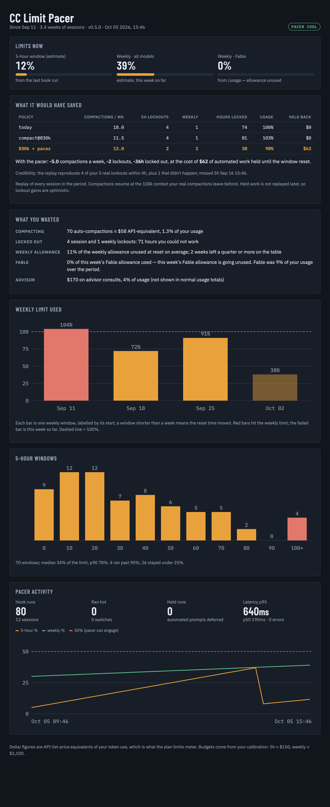

# cc-limit-pacer

Paces Claude Code against your 5-hour and weekly plan limits, so you get locked out less and see what you waste. It does three things:

1. **Paces your usage.** A hook watches your 5-hour and weekly usage. When you're on track to run out ("hot": a window is at least 50% used and on pace to hit its limit), it:
   - starts **new** sessions one model tier down (Fable → Opus, Opus → Sonnet) with the **advisor off**;
   - **holds automated runs** (SDK / `claude -p`, or sessions working in a temp directory) until the window resets.

   When usage cools down, it restores your model and advisor settings. Your interactive sessions are never held.
2. **Compacts later.** On 1M-window models, sessions auto-compact at about 830k tokens instead of about 570k, so you keep more context and compact less.
3. **Audits your usage.** What pacing would have saved, what you wasted (compacting, lockouts, unused weekly and Fable allowance), and how full your limits get, as text or a stats page.

Formerly `autocompact-gate`; state in `~/.claude/state/autocompact-gate` moves to `~/.claude/state/cc-limit-pacer` on first run.

Python 3.9+, standard library only.

## Install as a Claude Code plugin

**Before you start**
- You need Claude Code with plugin support, and `python3` (3.9+) on your `PATH`. The hooks and commands run Python.
- The repo is private. Claude Code clones it with your normal git credentials, so `git clone https://github.com/RahulBalakavi/cc-limit-pacer` has to work for you first (for example `gh auth login`, or access granted to your GitHub account).

**1. Install.** From a terminal:

```bash
claude plugin marketplace add RahulBalakavi/cc-limit-pacer
claude plugin install cc-limit-pacer@cc-limit-pacer
```

Or from inside Claude Code:

```
/plugin marketplace add RahulBalakavi/cc-limit-pacer
/plugin install cc-limit-pacer@cc-limit-pacer
```

Restart Claude Code (or start a new session) so the hooks and commands load.

**2. Check it's installed.**

```bash
claude plugin details cc-limit-pacer@cc-limit-pacer
```

```
cc-limit-pacer 0.1.1
Component inventory
  Skills (6)  backtest, calibrate, setup, simulate, status, uninstall
  Hooks (2)  SessionStart, UserPromptSubmit  (harness-only — no model context cost)
Projected token cost
  Always-on:   ~233 tok   added to every session
```

**3. Set it up inside Claude Code.**

```
/cc-limit-pacer:calibrate 36 24 "2026-10-09 11:00"
/cc-limit-pacer:simulate
/cc-limit-pacer:setup
/cc-limit-pacer:status
```

Run them in that order. The calibrate numbers are your 5-hour %, your weekly %, and the weekly reset time, all from `/usage`.

| Command | What it does | Changes anything? |
|---|---|---|
| `/cc-limit-pacer:calibrate <5h%> <weekly%> "<weekly reset>"` | learns your budget from one `/usage` reading | writes its own state only |
| `/cc-limit-pacer:simulate [--days N]` | replays your last month under each policy, so you can see if it helps *you* | no |
| `/cc-limit-pacer:backtest [--days N]` | lists every real lockout in your transcripts and replays each one | no |
| `/cc-limit-pacer:setup [--compact-at TOKENS]` | sets `autoCompactWindow` so sessions compact at about 830k, after backing up `settings.json` | yes, one setting |
| `/cc-limit-pacer:status` | shows whether you're hot or cool, which levers are active, held runs, and lockouts per week before vs. since install | no |
| `/cc-limit-pacer:audit [--days N \| --since YYYY-MM-DD] [--fable-pct P]` | over the last 23 days by default, or from a fixed start date: what the pacer would have saved (compactions, lockouts, hours locked), what you wasted (compacting, lockouts, unused weekly and Fable allowance, advisor), and how full your limits get | no |
| `/cc-limit-pacer:stats [--days N \| --since YYYY-MM-DD] [--fable-pct P]` | the same as a stats page, published as an artifact (or opened locally) | no |
| `/cc-limit-pacer:report [--hours N]` | bug checklist: errors, slow runs, missed lockouts, sensor drift, settings changes | no |
| `/cc-limit-pacer:verbose [on\|off]` | log every hook run in full (for trials and debugging); off by default | its own config only |
| `/cc-limit-pacer:uninstall` | restores `autoCompactWindow` and any model or advisor setting the pacer changed | yes, restores |

- **The pacer hooks start with the plugin.** They change nothing until you've calibrated and your usage actually runs hot.
- **Plugins can't change `autoCompactWindow` themselves**, which is why `setup` exists.

**Update**

```bash
claude plugin marketplace update cc-limit-pacer
claude plugin update cc-limit-pacer@cc-limit-pacer
```

Then restart Claude Code. Your calibration and logs live in `~/.claude/state/cc-limit-pacer/`, so updates keep them.

**Uninstall**

```
/cc-limit-pacer:uninstall
```

```bash
claude plugin uninstall cc-limit-pacer@cc-limit-pacer
claude plugin marketplace remove cc-limit-pacer
```

Run `/cc-limit-pacer:uninstall` first. Once the plugin is removed, its command to restore your settings is gone too.

**Install from a local checkout** (to try changes before pushing):

```bash
git clone https://github.com/RahulBalakavi/cc-limit-pacer ~/cc-limit-pacer
claude plugin marketplace add ~/cc-limit-pacer
claude plugin install cc-limit-pacer@cc-limit-pacer
```

After editing, bump `version` in `.claude-plugin/plugin.json`, then run the two update commands above. `claude plugin validate .` checks the manifest.

**Troubleshooting**
- **`marketplace add` fails with an auth or "not found" error:** you don't have access to the private repo yet, or git isn't signed in to GitHub.
- **The commands don't appear:** restart Claude Code after installing or updating.
- **The hooks fire twice:** you also ran the script install (`python3 limit_pacer.py install` without `--plugin`). Run `python3 limit_pacer.py install --plugin` once; it removes the duplicate hooks from `settings.json` and keeps the plugin's.
- **An automated run was "held":** that's the pacer protecting your limit. Set `LIMIT_PACER_ALLOW=1` to let it through, or wait for the reset time in the message.

## Or run the scripts directly

The outputs below are sample numbers; yours will differ.

Every step before `install` is read-only.

**1. Get the code.**

```bash
git clone https://github.com/RahulBalakavi/cc-limit-pacer && cd cc-limit-pacer
```

**2. Check it works on your machine.** This uses a fake `~/.claude` in a temp directory and touches nothing real.

```bash
python3 test_pacer.py
```

```
ok
pacer ok
```

**3. Teach it your budget.** Take the numbers from `/usage` in the CLI, or from the usage card in the app.

```bash
python3 limit_pacer.py calibrate --five-hour 36 --weekly 24 --weekly-reset "2026-10-09 11:00"
```

```
budgets (API-equivalent $): {'five_hour': 150.0, 'seven_day': 1100.0}
local estimate now: {'five_hour': '36%', 'seven_day': '24%'} (should match what you entered)
```

**4. Replay your last month under each policy.** This is the main evidence.

```bash
python3 simulate.py --days 32
```

```
41210 events over 4.3 weeks; budgets from calibration (5h=150, week=1.1e+03)
real lockouts found in transcripts: 5 5h, 1 weekly

real compactions leave a median 100k context; the simulation compacts to that

policy         compactions/wk 5h lockouts  weekly hours locked  usage  held back
today                    18.0           4       1         74.0   100%         $0
compact@830k             11.5           4       1         81.0   103%         $0
830k + pacer             13.0           2       1         38.0    98%        $62
```

How to read the rows:
- **`today` is the sanity check.** It replays what actually happened, and its lockout counts should roughly match the real ones on the line above (here 4 vs 5 five-hour, 1 vs 1 weekly).
- **`compact@830k`** gives about a third fewer compactions, but the extra usage brings lockouts sooner.
- **`830k + pacer`** is what `install` sets up: 28% fewer compactions and about half the hours locked. In exchange, $62 of batch work waits during hot stretches.

**5. Replay each real lockout one by one.**

```bash
python3 backtest.py --days 32
```

```
2410 sessions; 6 lockouts found

lockout (local time)    locked 500k if hot 250k if hot  result
5h   Sep 14 21:10         1.4h         99%         86%  no help
5h   Sep 19 16:05         1.8h        103%         95%  no help
week Sep 20 11:40        60.1h         98%         89%  0.4h later
...
5h   Sep 30 22:15         0.2h        101%         91%  no help

locked out 71.0h total; gate would have given back ~0.5h
if every session compacted at 500k: 3% less usage over 32d (only 41 of 2410 sessions ever passed 500k)
```

This is why compaction alone is the wrong knob.
- **The percentage columns** are your usage at the moment of lockout, replayed with early compaction while hot, as a share of the limit.
- **Compacting earlier barely moves them**, because only a few dozen sessions ever go past 500k.
- **Lockouts come from volume.** That's what the pacer's other levers go after: holding batch runs and dropping a model tier.

**6. Install.**

```bash
python3 limit_pacer.py install
```

```
installed: compaction at ~830k (autoCompactWindow=862000); pacer on SessionStart, UserPromptSubmit; hook=~/.claude/hooks/limit_pacer.py
```

Add `--compact-at 700000` to compact earlier.

**7. Check on it.** The lockouts-per-week line is the number that proves the value over time.

```bash
python3 ~/.claude/hooks/limit_pacer.py status
```

```
usage-source=local-estimate  state=cool
  five_hour used= 12.0%  pace=0.50  resets in   3.0h
  seven_day used= 39.0%  pace=0.80  resets in  91.0h
80 hook runs; hot on 0; held 0 automated prompts
lockouts: 6 in the 30d before install (1.4/wk); 0 since install (0.0/wk over 1.0d)
```

**8. Undo everything.**

```bash
python3 limit_pacer.py uninstall
```

## How it behaves once installed

- **Settings:** `install` backs up `~/.claude/settings.json`, sets `autoCompactWindow`, and adds a `SessionStart` and a `UserPromptSubmit` hook. Each runs in about 0.2s.
- **While hot:** it writes `model` one tier down and `advisorModel: "off"` into your settings, so new sessions pick them up. It shows a one-line notice when it switches state.
- **When it cools down:** it restores those settings, unless you changed them yourself in the meantime.
- **Spare week:** once a quarter of the week has passed, if it is on track to end below `spare_below`% of the weekly limit, new sessions start on `spare_model` (Fable by default). The allowance that would go unused at reset buys the best model. It switches back when the projection reaches `spare_below`+5% or usage runs hot.
- **Orphaned step-down:** if settings still hold the hot-mode pair (one tier down, advisor `off`) but the pacer has no record of writing them, it restores the model and advisor you had at install.
- **Self-calibration:** every lockout Claude Code writes into a transcript is a 100% reading, so the pacer refits that window's budget from it (a jump of more than 2x is treated as another account and ignored). An estimate past 100% while calls are still going through raises the budget too. Whenever Claude Code caches a fresh `/usage` reading for your account in `~/.claude.json` (it does each time `/usage` is opened in the terminal), that reading replaces the budgets outright, and `/cc-limit-pacer:stats` and `:status` feed in the desktop app's reading when the session has a usage tool. `calibrate` stays available for a manual reset; refits are listed under `learned` in `calibration.json`.
- **Held runs:** automated prompts are refused with `holding automated run … retry after Mon 04:40`. When a held run needs to go now, set `LIMIT_PACER_ALLOW=1`.
- **Logs:** every hook run is written to `~/.claude/state/cc-limit-pacer/pacer.jsonl`.
- **What the replay leaves out:** quality loss from compacting or from cheaper models, and held work running later, so the lockout gains are optimistic.

| Config (`~/.claude/state/cc-limit-pacer/config.json`) | Default | |
|---|---|---|
| `levers` | `true` | switch model and advisor while hot |
| `hold_batch` | `true` | hold automated runs while hot |
| `spare_model` | `fable[1m]` | model for new sessions in a spare week. `""` turns spare-week mode off |
| `spare_below` | `90` | projected end-of-week % below which a week counts as spare |
| `use_statusline` | `true` | trust the statusline's `rate_limits`. Set `false` if several accounts share one `~/.claude` |

## Logs and the daily check

Logs live in `~/.claude/state/cc-limit-pacer/` and rotate at 5 MB.

- **`errors.jsonl`, always on.** Any exception is written with its full traceback, and the prompt still goes through. A bug in this plugin never blocks your session.
- **`pacer.jsonl`, quiet by default.** It logs only runs where something happened: a hot↔cool switch, a settings change by the levers (or a restore skipped because you changed it yourself), or a held prompt.
- **Verbose mode** logs every hook run in full: session, entrypoint, cwd, the usage estimate and its source, time to reset, calibration age and budgets, and how long the hook took. Turn it on when you try the plugin or chase a bug, and off again afterwards:

```
/cc-limit-pacer:verbose on                    # or: python3 limit_pacer.py verbose on
/cc-limit-pacer:verbose off
LIMIT_PACER_VERBOSE=1 claude ...           # verbose for one process only
```

```
/cc-limit-pacer:report                        # or: python3 limit_pacer.py report --hours 24
```

```
cc-limit-pacer 0.3.0 — last 24h: 29 logged hook runs, 0 errors
  latency  p50=96ms  p95=155ms  max=155ms  (12 timed runs)
  usage source {'local-estimate': 29}
  now  cool  {'five_hour': '12% (pace 0.5)', 'seven_day': '39% (pace 0.8)'}

OK — nothing to look at
```

`report` exits 1 and lists what needs a look when it finds any of these. The latency, sensor and coverage checks need verbose logs.
- **Hook errors**, with the latest error message.
- **A slow hook:** p95 over 1s. Every prompt waits on it.
- **A missed lockout:** a real lockout in your transcripts while the pacer was cool in the hour before it.
- **Sensor drift:** the estimate read under 80% just before a lockout.
- **No usable reading:** usage is uncalibrated, the calibration is more than 3 days old, or the sensor failed.
- **A held interactive prompt**, meaning a prompt that wasn't batch work got held.
- **A skipped restore:** you changed `model` or `advisorModel` while hot, so the pacer left your choice in place.
- **Hooks not loaded:** no `UserPromptSubmit` runs were logged.

## Audit and stats page



*Sample data (`python3 docs/sample_stats.py`); your page shows your own numbers.*

```
/cc-limit-pacer:audit                         # or: python3 audit.py --fable-pct 0
/cc-limit-pacer:stats                         # or: python3 audit.py --html stats.html
```

```
WHAT IT WOULD HAVE SAVED (replay of your sessions)
  policy         compactions/wk 5h lockouts  weekly hours locked  usage  held back
  today                    18.0           4       1         74.0   100%         $0
  compact@830k             11.5           4       1         81.0   103%         $0
  830k + pacer             13.0           2       1         38.0    98%        $62
  → -5.0 compactions/wk, -2 lockouts, -36h locked

WHAT YOU WASTED
  compacting      70 auto-compactions ≈ $58 API-equivalent (1.3% of your usage)
  locked out      4 session + 1 weekly lockouts, 71h unable to work
  advisor         $170 (4% of usage) on advisor consults
  Fable           0% used this week — the whole Fable allowance is going unused

HOW MUCH OF EACH LIMIT YOU USE
  Sep 25 – Oct 02     91%
  Oct 02 – Oct 09     38%  (so far)
  5h windows      70 used; median 34%, p90 78%; 4 ran ≥90%, 26 stayed under 25%
```

- **Saved** reuses the `simulate` replay. Its credibility line compares the replay's lockouts with your real ones; a big gap means the calibration is off.
- **Wasted** is measured from transcripts: the summary call plus cache rebuild of every auto-compaction, hours between each lockout and its reset, weekly allowance left at reset (full weeks only), advisor consults.
- **Fable** has its own weekly allowance that only `/usage` reports. Pass `--fable-pct` with the "Weekly · Fable" %; the commands read it for you when Claude has a usage tool.
- `stats` writes `~/.claude/state/cc-limit-pacer/stats.html`: current meters, the savings table, the waste ledger, weekly and 5h usage charts, and pacer activity (usage over time needs verbose logs).

## What's verified

- **Model and advisor changes only reach new sessions.** Changing `model` in settings during a run doesn't affect it. `advisorModel: "off"` turns the advisor off; `null` and `""` do not.
- **Held headless runs:** a held `claude -p` run returns the hold message as its result and **exits 0**. Batch scripts should check the result text.
- **Compaction timing:** Claude Code compacts about 32k tokens below `autoCompactWindow`. If one turn jumps past the model's real window, the session ends with `Prompt is too long` and nothing recovers it.
- **The usage estimate is approximate.** It only sees this machine's transcripts. Usage from claude.ai or other machines is invisible, so recalibrate if the `status` numbers drift from `/usage`.

## Files

| File | What |
|---|---|
| `limit_pacer.py` | the pacer hook, plus the `install` / `uninstall` / `calibrate` / `status` commands |
| `.claude-plugin/`, `hooks/`, `commands/` | the plugin: manifest, the two hooks, and the `/cc-limit-pacer:*` commands |
| `audit.py` | the audit and the stats page |
| `docs/sample_stats.py` | renders the stats page from sample data, for the screenshot |
| `simulate.py` | replays a month of your history under each policy and lever |
| `backtest.py` | lockout finder and per-window replay |
| `test_pacer.py` | `python3 test_pacer.py`, uses a fake `~/.claude` in a temp directory |
